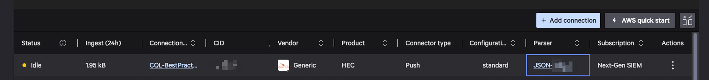
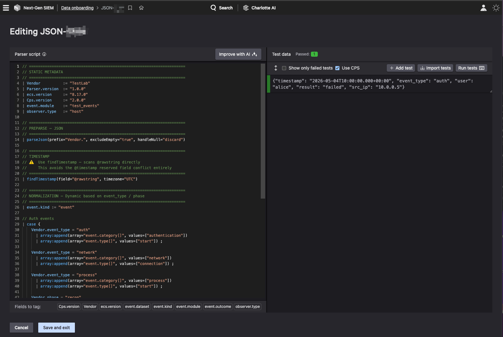

# INGEST Testing — CQL correlate() Event Pusher

This folder contains everything needed to push synthetic test events into CrowdStrike NGSIEM and verify CQL `correlate()` queries.

## Files

| File | Purpose |
|------|---------|
| `push_events.py` | Python script that reads the events file, rebases timestamps to now, and sends events to the HEC ingest endpoint |
| `events.json` | 13 synthetic log events covering auth, network, process, recon, exploit, and exfil scenarios |
| `JSON-CQLTest.parser` | CQL parser (JSON-CQLTest) that normalises ingested events to ECS fields |
| `export.ndjson` | NDJSON export of the 13 ingested events as parsed by NGSIEM — shows the final `Vendor.*` and ECS field names for use in queries |


---

## Connection Details

| Field | Value |
|-------|-------|
| Connection Name | `CQL-BestPractice-EventPusher` |
| Connection ID | `<cid-ngsiem-connect_id>` |
| Vendor | Generic |
| Configuration Type | standard |
| Parser | `JSON-CQLTest` |
| API URL | `https://<cid-ngsiem-connect_id>.ingest.us-1.crowdstrike.com/services/collector` |
| Timezone | UTC |
| Host Enrichment | Enabled |
| User Enrichment | Enabled |
| Connector Author | CrowdStrike |
| Description | CQLTest — Event Pusher for CQL query testing |

---

## Step 1 — Create the Data Connector (Falcon Console)

You need a Data Connector before you have a valid ingest URL or API token. The connector is per-connection and scoped — there is no generic platform-level ingest key.

### Connector type selection

When adding a connection, you will see two relevant options:

| Connector | Type | Use Case |
|-----------|------|----------|
| **Falcon LogScale Collector** | Agent-based (Pull) | Install on a host to ship logs (syslog, file tailing) |
| **HEC / HTTP Event Connector** | HTTP Push | Scripts or apps that POST data over HTTP — **choose this one** |

> This Python script does an HTTP POST directly to NGSIEM. That maps exactly to the HEC connector.

### Steps

1. Falcon Console → **Data connectors** → **Data connections** → **+ Add connection**
2. Select **HEC / HTTP Event Connector** → click **Configure**
3. Fill in:
   - **Connection Name**: `CQL-BestPractice-EventPusher`
   - **Description**: `CQLTest — Event Pusher for CQL query testing`
   - **Parser**: `JSON-CQLTest` (see [Step 2 — Install the Parser](#step-2--install-the-json-CQLTest-parser) below)
4. Accept Terms & Conditions → **Save**

Once saved and active, the connection appears in the Data connections list:



---

## Step 2 — Install the JSON-CQLTest Parser

NGSIEM does **not** provide a raw JSON parser out of the box. The console gives you a **CrowdStrike Parsing Standard (CPS) template** — a blank form you must fill in. The completed parser is `JSON-CQLTest.parser` in this folder.

### Why the default CPS template fails for these events

The unmodified template has three problems when used with `correlate_test_events.json`:

1. **`@timestamp` field name conflict** — `parseJson(prefix="Vendor.")` turns `@timestamp` into `Vendor.@timestamp`. The `@` prefix is reserved in LogScale syntax and breaks timestamp resolution entirely. The fix is to use `findTimestamp(field="@rawstring")` which scans the raw string directly and avoids the collision.

2. **`parseTimestamp` vs `findTimestamp`** — Using `parseTimestamp(field="Vendor.timestamp", ...)` requires the events to have already renamed `@timestamp` to `timestamp`. `findTimestamp` handles either case automatically.

3. **Hardcoded `event.category`** — The template defaults to a single category (e.g. `authentication`) applied to every event. These 13 events have three different schemas (`event_type: auth/network/process` and `phase: recon/exploit/exfil`). The parser uses a `case {}` block to branch on each.

### Installing the parser

1. Falcon Console → **Data connectors** → **Parsers** → **+ New parser**
2. Name it `JSON-CQLTest`
3. Paste the contents of `JSON-CQLTest.parser`
4. Click **Run tests** to verify — the test panel should show **Passed: 1** against the sample auth event
5. Save and associate it with the `CQL-BestPractice-EventPusher` connection



---

## Step 3 — Generate the API Key

After saving the connector:

1. Falcon Console → **Data connectors** → **Data connections**
2. Find `CQL-BestPractice-EventPusher` → click **⋮** → **Generate API key**
3. Copy the key immediately — **it is shown only once**. If you lose it you must regenerate (which invalidates the old key immediately).

This gives you:
- **API URL** → `https://<cid-ngsiem-connect_id>.ingest.us-1.crowdstrike.com/services/collector`
- **API Key** → your `LOGSCALE_TOKEN`

> The ingest URL is **per-connector**, not a generic platform URL. Every data connection gets its own unique endpoint.

---

## Step 4 — Run the Ingest Script

### Prerequisites

- Python 3.9+ (stdlib only — no third-party packages required)
- API key from Step 3

```bash
cd ingest-testing/

export LOGSCALE_TOKEN=<your-api-key-from-step-3>

python3 push_events.py
```

Expected output:

```
Events file : /path/to/ingest-testing/events.json
Target host : https://<cid-ngsiem-connect_id>.ingest.us-1.crowdstrike.com

  Loaded 13 events from events.json
  File range:  2026-05-04T10:00 UTC – 2026-05-04T13:01 UTC (span 181 min)
  Rebased to:  2026-05-04T10:59 UTC – 2026-05-04T14:00 UTC (span 181 min)

HTTP 200 — 13 events ingested successfully
Done. Wait ~5s, then run your correlate() queries over the last 4h.
```

After a successful run, the connector status changes from **Pending** → **Active** in the Falcon console.

### Override the host (optional)

```bash
export LOGSCALE_HOST=https://<alternate-host>
export LOGSCALE_TOKEN=<your-api-key>
python3 push_events.py
```

### Use a custom events file

```bash
python3 push_events.py /path/to/my_events.json
```

---

## Step 5 — Verify Ingestion

1. Falcon Console → **Data connectors** → **Data connections** → confirm **Status = Active**
2. Click **⋮** → **Show events** to validate in Advanced Event Search
3. Or run manually in Advanced Event Search:

```
#repo = "<your-repo>" | #type = "JSON-CQLTest"
```

Then run your CQL `correlate()` queries scoped to the **last 4 hours** (events span ~3h 1min).

---

## How It Works

### Ingest flow

```
events.json
        │
        ▼
push_events.py
  • Reads flat JSON array
  • Rebases timestamps: latest event → now, offsets preserved
  • Wraps each event as HEC: {"time": <epoch>, "event": {...}}
  • POSTs newline-delimited JSON to /services/collector
        │
        ▼
CrowdStrike NGSIEM HEC endpoint  (Splunk HEC-compatible)
        │
        ▼
JSON-CQLTest parser
  • Parses JSON fields under Vendor.* prefix
  • Resolves timestamp via findTimestamp(@rawstring)
  • Normalises to ECS event.category / event.type via case {}
  • Maps Vendor fields → ECS fields
```

### HEC endpoint vs Humio unstructured endpoint

These are two different ingest APIs with incompatible payload formats:

| | HEC `/services/collector` | Humio unstructured `/api/v1/ingest/humio-unstructured` |
|---|---|---|
| **Format** | Newline-delimited JSON objects | JSON array with `tags` + `messages` wrapper |
| **Timestamp** | `time` field (epoch seconds) outside the event | `@timestamp` embedded in each message string |
| **Used by** | This connector (`CQL-BestPractice-EventPusher`) | Generic LogScale repository ingest |
| **Auth token source** | Data Connector → Generate API key | Repository → Settings → Ingest Tokens |

> The connector URL ends in `/services/collector` — this is HEC. Using the Humio unstructured payload against this endpoint will fail.

### HEC payload format

Each event is a separate JSON object on its own line — **not a JSON array**:

```json
{"time": 1746352800, "event": {"event_type": "auth", "user": "alice", "result": "failed", "timestamp": "2026-05-04T10:00:00.000+00:00", ...}}
{"time": 1746352860, "event": {"event_type": "auth", "user": "bob",   "result": "success", "timestamp": "2026-05-04T10:01:00.000+00:00", ...}}
```

The `time` field (epoch seconds) is used by NGSIEM for indexing. The full event object (including `timestamp`) is passed to the parser.

### Dynamic timestamp rebasing

The timestamps stored in `events.json` are fixed reference values used only to define the relative spacing between events. `push_events.py` rebases them at runtime:

1. Finds the latest timestamp across all events
2. Computes `delta = now − latest`
3. Adds `delta` to every event's `timestamp`

This means the most recent event always lands at approximately the current time, and the full spread (~3h 1min) stays within the recent retention window regardless of when the script is run. The `time` field in the HEC wrapper is also recomputed from the rebased timestamp.

### Why events use `timestamp` not `@timestamp`

The source events originally used `@timestamp`. This causes a conflict:

- `parseJson(prefix="Vendor.")` would produce `Vendor.@timestamp`
- The `@` character is reserved syntax in LogScale — this field cannot be referenced normally
- `findTimestamp(field="@rawstring")` bypasses this entirely by scanning the raw JSON string for any recognised ISO 8601 pattern, regardless of field name

The events in `events.json` use `timestamp` (no `@`) for clarity, but `findTimestamp` would handle either.

---

## Test Events

### Auth events (`event_type: auth`)

| timestamp | user | result | src_ip |
|-----------|------|--------|--------|
| 10:00 UTC | alice | failed | 10.0.0.5 |
| 10:01 UTC | bob | success | 10.0.0.9 |

### Network events (`event_type: network`)

| timestamp | user/host | dst_ip | dst_port |
|-----------|-----------|--------|----------|
| 10:05 UTC | alice | 192.168.1.100 | 445 |
| 10:06 UTC | carol | 10.0.0.2 | 22 |
| 11:02 UTC | ws-01 / pid 1234 | 185.220.101.5 | 443 |
| 11:03 UTC | ws-02 / pid 9999 | 8.8.8.8 | 53 |

### Process events (`event_type: process`)

| timestamp | host | pid | image | cmdline |
|-----------|------|-----|-------|---------|
| 11:00 UTC | ws-01 | 1234 | cmd.exe | `cmd.exe /c whoami` |
| 11:00:30 UTC | ws-01 | 5678 | notepad.exe | `notepad.exe` |

### Attack chain events (`phase`)

| timestamp | phase | host | detail |
|-----------|-------|------|--------|
| 12:00 UTC | recon | victim-01 | tool=nmap |
| 12:01 UTC | recon | victim-02 | tool=nmap |
| 12:30 UTC | exploit | victim-01 | cve=CVE-2024-1234 |
| 13:00 UTC | exfil | victim-01 | bytes_sent=52000 |
| 13:01 UTC | exfil | victim-03 | bytes_sent=1000 |

---

## JSON-CQLTest Parser

The parser (`JSON-CQLTest.parser`) performs these steps in order:

1. **Static metadata** — sets `Vendor`, `Parser.version`, `ecs.version`, `event.module`
2. **Preparse** — `parseJson(prefix="Vendor.")` extracts all JSON fields under the `Vendor.*` namespace
3. **Timestamp** — `findTimestamp(field="@rawstring")` auto-detects the ISO 8601 timestamp from the raw JSON string
4. **Normalisation** — `case {}` block maps `event_type` / `phase` to ECS `event.category[]` and `event.type[]`
5. **Field mapping** — maps `Vendor.*` fields to canonical ECS fields:

| Vendor field | ECS field |
|---|---|
| `Vendor.user` | `user.name` |
| `Vendor.src_ip` | `source.ip` |
| `Vendor.dst_ip` | `destination.ip` |
| `Vendor.dst_port` | `destination.port` |
| `Vendor.host` | `host.name` |
| `Vendor.pid` | `process.pid` |
| `Vendor.image` | `process.executable` |
| `Vendor.cmdline` | `process.command_line` |
| `Vendor.cve` | `vulnerability.id` |
| `Vendor.bytes_sent` | `network.bytes` |

### ECS normalisation by event type

| `event_type` / `phase` | `event.category[]` | `event.type[]` |
|---|---|---|
| `auth` | `authentication` | `start` |
| `network` | `network` | `connection` |
| `process` | `process` | `start` |
| `recon` | `network` | `info` |
| `exploit` | `intrusion_detection` | `info` |
| `exfil` | `network` | `info` |
| _(anything else)_ | `host` | `info` |

---

## Troubleshooting

| Symptom | Likely Cause | Fix |
|---------|-------------|-----|
| `HTTP 403` | Wrong token, deleted connection, or connector paused | Regenerate API key; old key is immediately invalidated |
| `HTTP 400` | Wrong payload format (e.g. Humio array sent to HEC endpoint) | Ensure payload is newline-delimited `{"time":..., "event":{...}}` objects |
| Connection stays **Pending** | No events have been received yet | Run the script; status updates after first successful ingest |
| `Vendor.@timestamp` parse error | Events contain `@timestamp` key | Use `findTimestamp(field="@rawstring")` in parser, or rename field to `timestamp` in events |
| Timestamp not set on events | `parseTimestamp` can't find `Vendor.timestamp` | Switch to `findTimestamp(field="@rawstring")` — it auto-detects any ISO 8601 pattern |
| All events get `event.category=authentication` | Parser uses hardcoded category instead of `case {}` | Replace static `array:append` with the `case {}` block from `JSON-CQLTest.parser` |

### Token rotation

To regenerate a token: **⋮** → **Generate API key**. The previous token is **immediately invalidated** — update `LOGSCALE_TOKEN` before the next run.

```bash
export LOGSCALE_TOKEN=<new-api-key>
```
